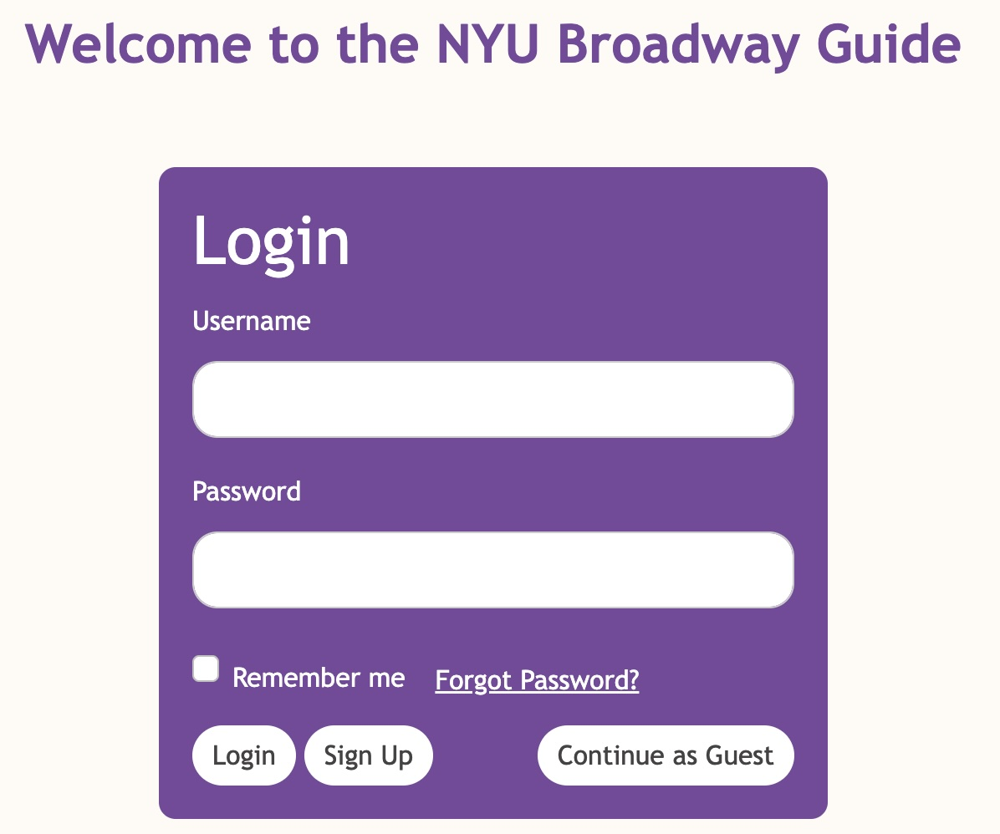
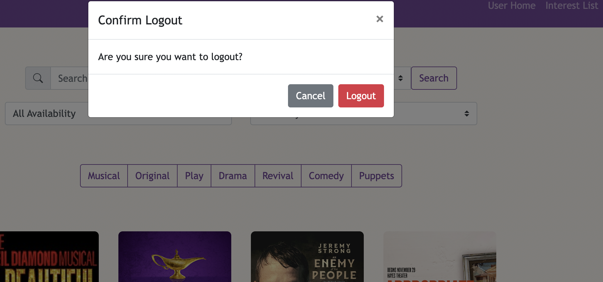
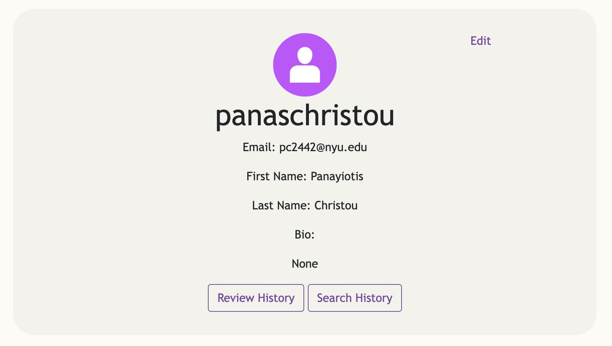
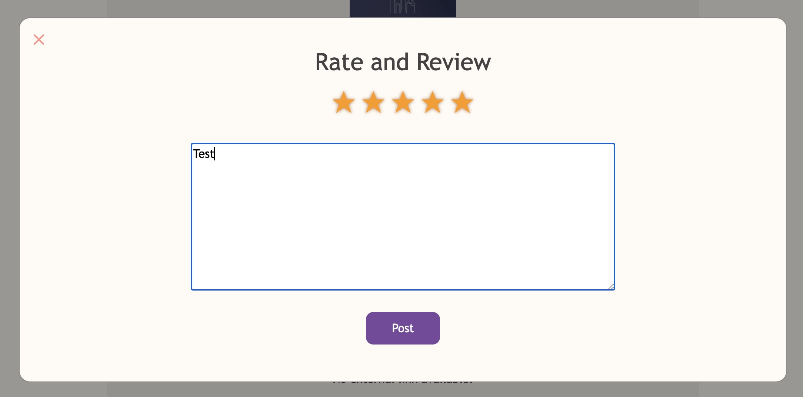
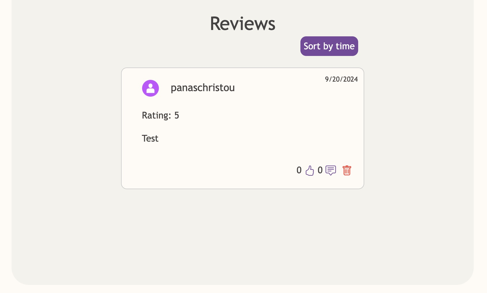
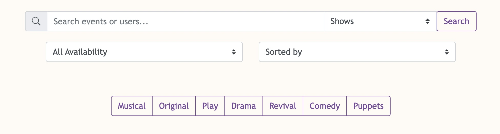
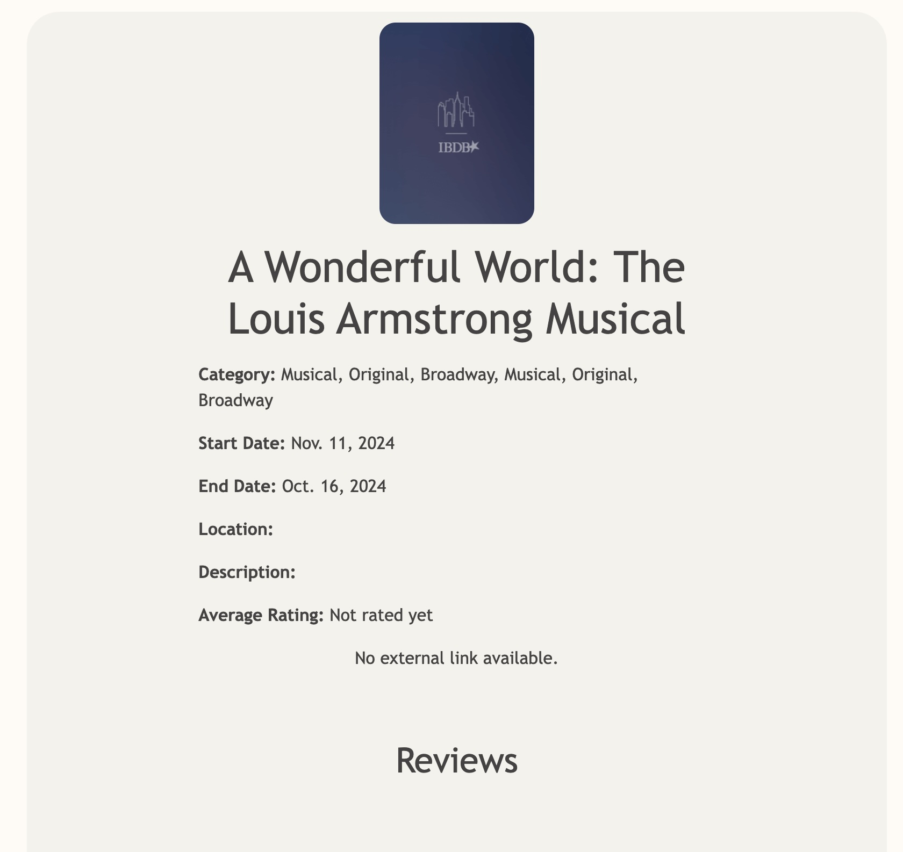

# Forked Project from my Team's Project repo

NYU Event Application

# Coverage and Badges
Coverage and badges are shown in the original repo. The server on AWS has been shut down so the badges may not reflect that.

# How to start

`pip install -r installed_dependencies.txt`

Important: Pip freeze into installed_dependencies.txt, and leave requirements.txt empty

python manage.py runserver (To run on local host)

# Project Description
We created an event for NYU students to find events on Broadway and to connect with other students from NYU who are interested in similar events to discuss, review and rate those events.

# Project Features

# Project Images
## Login

## Logout

## Profile

## Interest List

## Review

## Review Shown

## Search Bar

## Title Page

